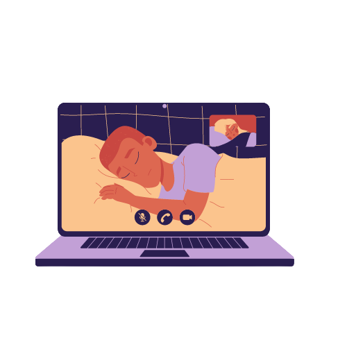
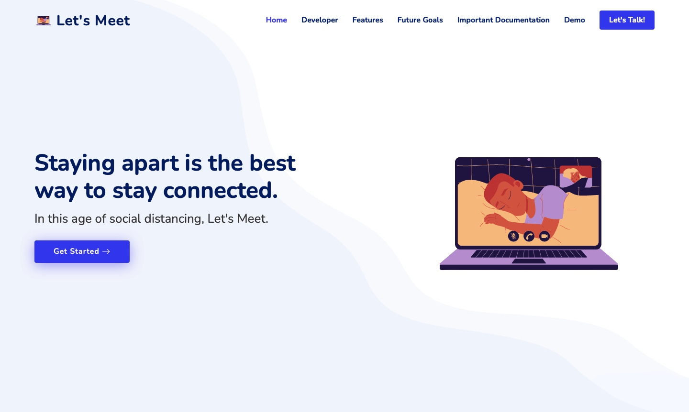
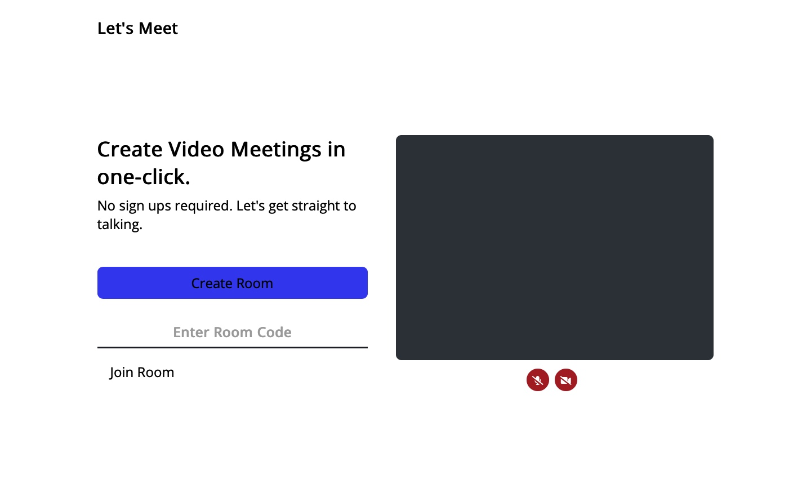
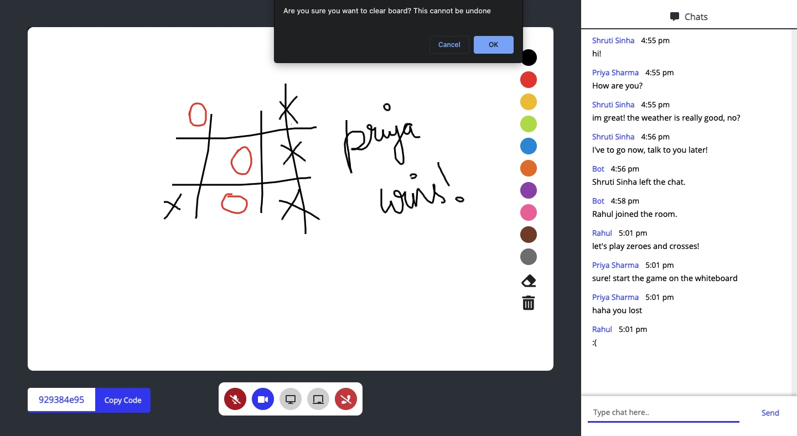
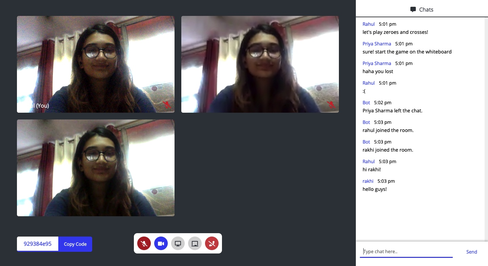

<h2>नमस्ते (Namaste)🙏🏻 , I'm Shruti Sinha! </h2>

<p><em>This is my entry for  <a href="https://microsoft.acehacker.com/engage2021/index.html">Microsoft Engage'21. </a> 
</em></p>

<br>All the supporting technical documentation and the demo video are available in the documentation folder of this repo.<br><br>

In this age of social distancing, Let's Meet. 
==============
#### A Microsoft Teams Clone built for Microsoft Engage 2021. ####

<br>

The Challenge
------------

Build a Microsoft Teams clone.

The solution should be a fully functional prototype with at least one mandatory functionality - a minimum of two participants should be able connect with each other using the product to have a video conversation.


What I Accomplished
-------------------



I successfully implemented the video calling feature. More than two people can currently video call together using the web app. I also implemented:

1. Switch audio on/off
2. Switch video on/off
3. Create your own meeting url
4. Join an existing meeting with more than two people
5. Adding own name to profile with which you join the meeting
6. Update whenever somebody joins or leaves the meeting
7. Copy URL in-meeting
8. Chatbox
9. Screenshare
10. Collaborative whiteboard
11. Leave meeting 

What I Learned
--------------------------------

Microsoft and the Acehacker team kept various sessions for us to learn more about the work culture at Microsoft. We also learned about new technologies that have been developed by Microsoft (ie Azure Communication Services) and about the Agile Methodology. 

The <strong>Agile Scrum Methodology</strong> has heavily influenced my work in the past 1 month. 
Agile scrum methodology is a project management system that relies on incremental development. Each iteration consists of two- to four-week sprints, where each sprint's goal is to build the most important features first and come out with a potentially deliverable product. <br>
Microsoft assigned us three sprints of 1-2 weeks each: <strong>Design, Build, and Adopt.</strong><br><br>
In the <strong>first two weeks</strong>, I researched on WebRTC, Agora, Jitsi and socket.io to decide on which SDK I wanted to use for my web app. Ended up deciding on WebRTC. Got working on establishing video communication between two connections. <br><br>
In the <strong>third and fourth week</strong>, I worked on adding additional features to my web app. <br><br>
In the <strong>last week</strong>, I ended up adding the chat feature and worked on the landing page as well as the UI for the whole web app.<br><br>


Running the Web App on your Local Device
--------------------------------

To run the web app in your local device, run the following commands in your terminal (macOS) or command prompt (Windows) :-

-Clone the GitHub repository into your local device by running the following command:
```bash
cd folder-you-want-to-download-code-in

git clone https://github.com/shrutayyyy/LetsMeet.git

cd LetsMeet
```
-Now that you're in the project folder, open terminal to download the needed node modules:
```bash
npm install
```
-Now run the server by running the following command:
```bash
npm start
```
The server should be running at <strong>localhost:3000</strong><br>
If localhost:3000 shows busy on your device, run the following commands:
```bash
sudo lsof -i :3000

kill -9 <PID>
```
Now localhost:3000 is free to run this application.
<br>
<br>
-To access the web app, in your project code folder, navigate to public/landing-page and from there open landing.html on any browser of your preference (Chrome recommended for best experience).<br><br>

Technologies Used 
-----------------


1. Node.js
2. HTML 
3. CSS 
4. Bootstrap
5. JavaScript
6. WebRTC
7. Socket.io


Future Possible Functionalities
-------------------------------

1. Add a sign up/authentication page
2. Improve upon the Adapt functionality in the web app
3. Add an additional feature of breakout rooms      
4. Increase Scalability 


Screenshots
-----------------
<br>


<br>


<br>


<br>


<br><br>

Check out the following links!
-----------------
<br>

Technical Documentation: [lets-meet.pdf](documentation/lets-meet.pdf)
<br><br>
Web App Flow: [web-app-flow.png](documentation/web-app-flow.png)
<br><br>
Demo Video: [Let's Meet!](https://youtu.be/Y7xJqFvXm6A)


